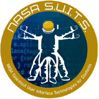

  

<h1 align="center">NASA SUITS HUD</h1>

  <em>A spacesuit heads up display for a simulated lunar EVA</em>  
  

## About

A student project building toward the NASA SUITS 2027 challenge, but not competing in the final showcase. The HUD reads live suit data from the Telemetry Stream Server (TSS) and guides an astronaut through egress, navigation, science tasks and ingress.

## Features

* Suit telemetry and caution alerts
* 2D map with pins and breadcrumbs
* Step by step procedures
* Voice assistant

## Contributors

* **Kenneth Chow** · [@kenecu1](https://github.com/kenecu1)
* **Vlad Lagutin** [@Londarh](https://github.com/Londarh)

---

